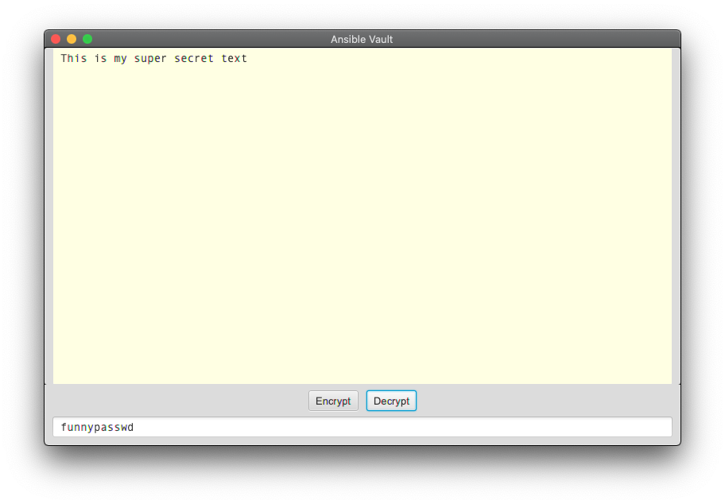

# JavaFX Ansible Vault Application

Handle Ansible Vaults with ease.   
Secrets encrypted by `ansible-vault` can be decrypted here and secrets encrypted here can be decrypted by `ansible-vault`.

### Easy peasy

Paste an encrypted vault variable into the text area, or just drag and drop a vault file into it   
   
... And press `Decrypt`   
   
Or press `Encrypt` on a clear text vault variable to encrypt it   

### Building and running

Maven build (requires Java 11) `mvn clean install`

To start the application execute `java -jar ansible-vault-fx-<version>.jar` on the command line.
    
### Notices and Limitations
Requires Java 11 or higher
The application handles versions 1.1 and 1.2 format of the vaults. It will cry and crash and burn with any previous versions of the vaults.
