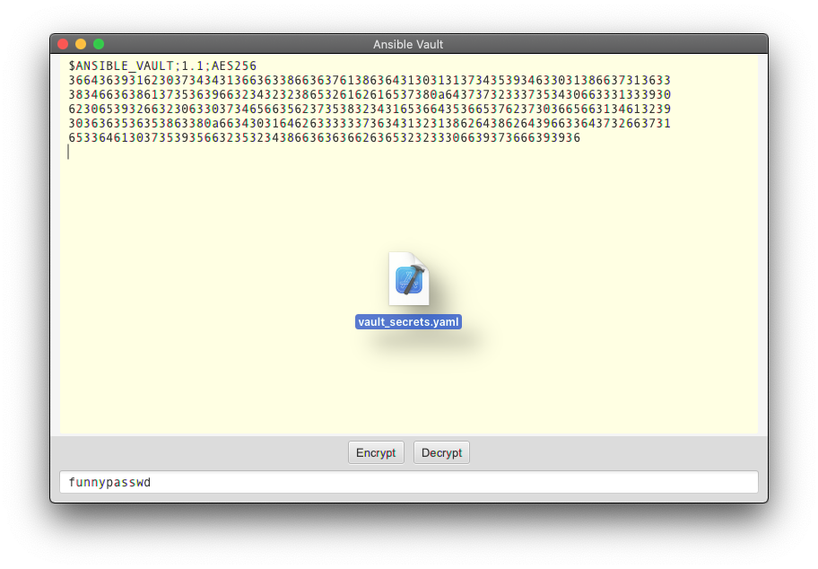

# JavaFX Ansible Vault Application

This application allows you to handle Ansible encrypted vaults.

### Easy peasy

Paste an encrypted vault variable into the text area   

... And press `Decrypt`   

Or press `Encrypt` on a clear text vault variable to encrypt it   

### Building and running

Maven build (requires Java 8) `mvn clean install`

To start the application, just double-click on the generated `ansible-vault-fx-<version>.jar` file.
    
### Notices and Limitations
Requires Java 8  
The application handles versions 1.1 and 1.2 format of the vaults. It will cry and crash and burn with any previous versions of the vaults.

_**Ansible uses 256 bits keys to handle encryption and decryption of the vaults, this means that
in order to handle these vaults you will need to install the unrestricted policy files from Oracle.
You have been warned.**_
